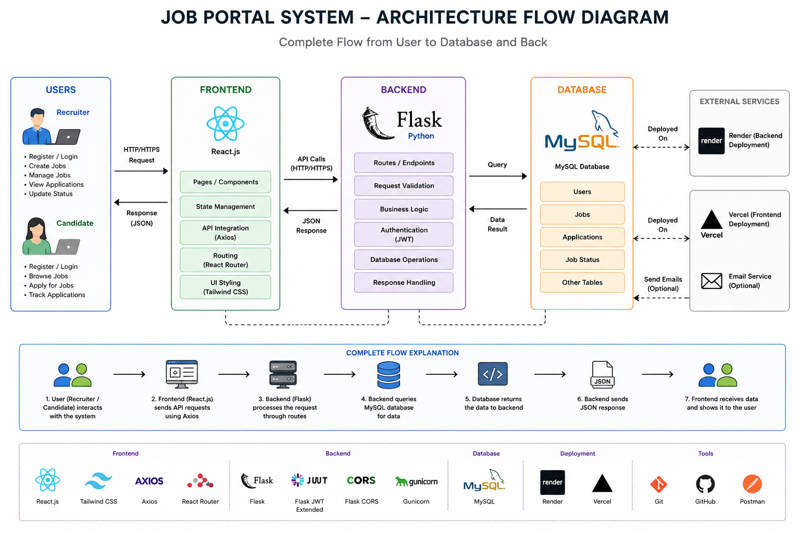

# Job Portal System

A full-stack job portal web application where companies can post jobs and candidates can apply for them. The platform provides separate functionalities for recruiters and job seekers with secure authentication and smooth application management.

## Project Overview

This project is built to simplify the hiring process by connecting recruiters and candidates on a single platform.

Recruiters can:
- Create and manage job postings
- View applications
- Update candidate application status

Candidates can:
- Register and login securely
- Browse available jobs
- Apply for jobs
- Track their applications

The project focuses on clean UI, secure backend APIs, database integration, and real-world deployment practices.

---

# Project Architecture



The diagram below explains the complete workflow of the project including frontend, backend, database communication, deployment, and user interaction flow.

---

# Tech Stack

## Frontend
- React.js
- Tailwind CSS
- Axios
- React Router DOM

## Backend
- Flask
- Flask JWT Extended
- Flask CORS
- Gunicorn

## Database
- MySQL

## Deployment
- Render (Backend)
- Vercel (Frontend)

## Other Tools
- Git & GitHub
- Postman
- VS Code

---

# Features

## Authentication
- User registration
- Secure login using JWT authentication
- Protected routes

## Job Management
- Create job posts
- Edit and delete jobs
- View all posted jobs

## Job Applications
- Apply for jobs
- Track application status
- Recruiter application management

## Dashboard
- Recruiter dashboard
- Candidate dashboard

## API Integration
- REST API based architecture
- Frontend connected with Flask backend

---

# Project Structure

```bash
Job-Portal-System/
│
├── frontend/
│   ├── src/
│   ├── public/
│   └── package.json
│
├── backend/
│   ├── routes/
│   ├── utils/
│   ├── app.py
│   ├── wsgi.py
│   └── requirements.txt
│
└── README.md
```

---

# Workflow

## User Side Workflow

1. User creates an account
2. User logs into the platform
3. User browses available jobs
4. User applies for a job
5. Application gets stored in the database

## Recruiter Side Workflow

1. Recruiter logs into the system
2. Recruiter creates a job posting
3. Applications are received from candidates
4. Recruiter reviews applications
5. Recruiter updates application status

---

# API Workflow

Frontend sends requests using Axios to Flask backend APIs.

Backend:
- Validates requests
- Processes business logic
- Connects with MySQL database
- Returns JSON responses

Authentication is handled using JWT tokens.

---

# Installation Guide

## Clone Repository

```bash
git clone https://github.com/your-username/job-portal.git
```

## Backend Setup

```bash
cd backend
pip install -r requirements.txt
```

Run backend server:

```bash
python app.py
```

## Frontend Setup

```bash
cd frontend
npm install
npm run dev
```

---

# Environment Variables

Create a `.env` file inside backend folder.

```env
MYSQL_HOST=your_host
MYSQL_USER=your_user
MYSQL_PASSWORD=your_password
MYSQL_DB=your_database
JWT_SECRET_KEY=your_secret_key
```

---

# Deployment

## Backend Deployment
Backend is deployed using Render with Gunicorn.

## Frontend Deployment
Frontend is deployed using Vercel.

---

# Future Improvements

- Resume upload feature
- Email notifications
- Admin analytics dashboard
- Advanced job filtering
- Interview scheduling system

---

# Learning Outcomes

Through this project, I learned:
- Full-stack web development
- REST API development
- Authentication using JWT
- Database integration
- Deployment and cloud hosting
- Frontend and backend integration

---

# Author

Lovely Mahour

B.Sc. (Hons.) Computer Science  
Keshav Mahavidyalaya, Delhi University
